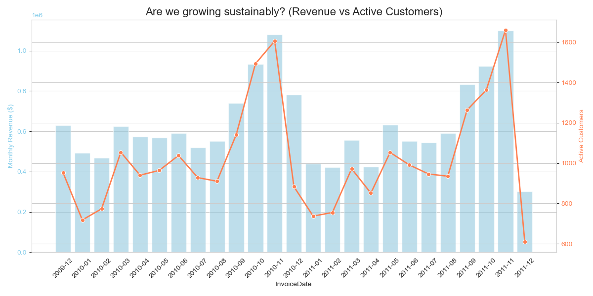
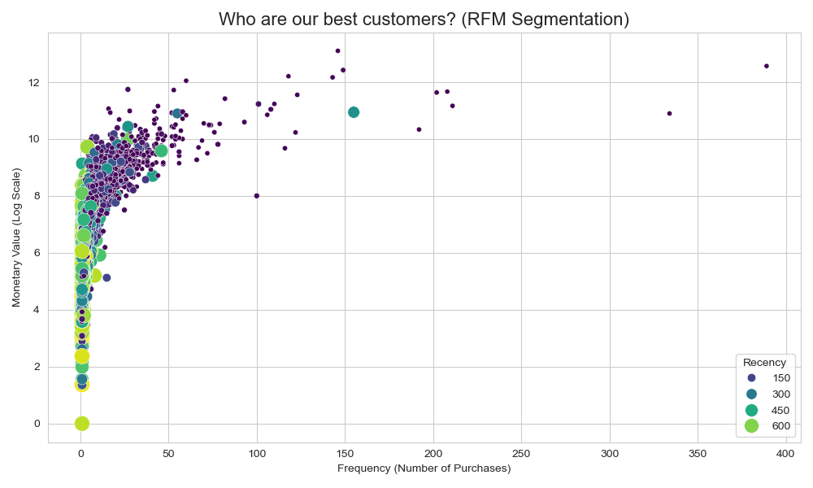
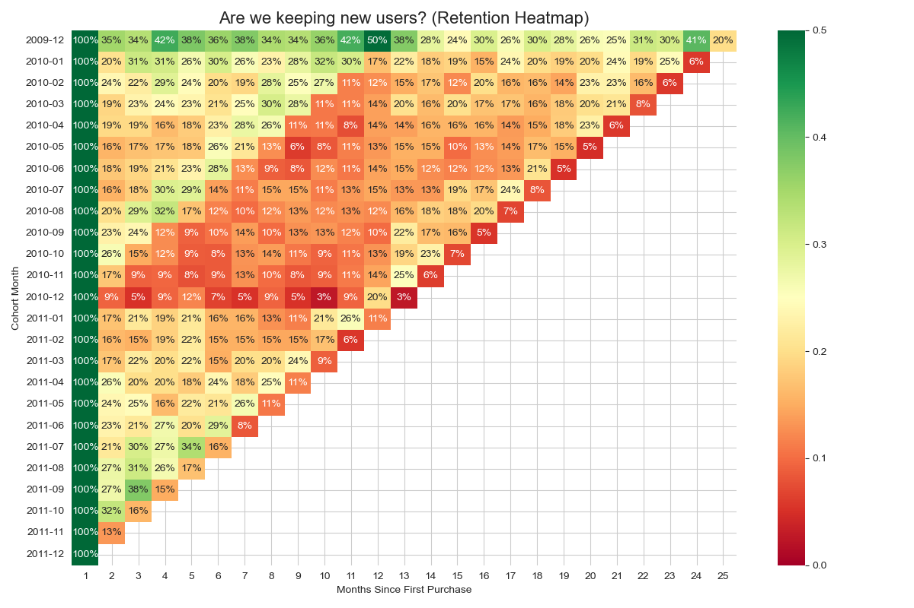

# E-Commerce Strategic Analysis: Customer Retention & Value

## Executive Summary
This project transforms raw transaction data into actionable business insights regarding customer retention and value. By cleaning the data, removing outliers, and performing cohort analysis, we aim to answer critical questions about sustainable growth and customer segmentation.

**Key Findings:**
*   **Growth:** Revenue is growing, but active customer count is lagging, suggesting a reliance on higher-value orders rather than new user acquisition.
*   **Segmentation:** A distinct group of "Champions" drives a significant portion of revenue, while a large "At Risk" segment requires re-engagement.
*   **Retention:** Early-stage retention drops significantly, indicating a "leaky bucket" problem in the first 3 months.

---

## Visual Insights

### 1. Are We Growing Sustainably?
**Business Question:** Is our revenue growth driven by acquiring *more* customers or just getting existing ones to spend *more*?



**Insight:**
The dual-axis chart reveals the relationship between revenue growth and customer acquisition. If revenue rises while active customers flatline, we are extracting more value per user (higher LTV). If both rise, we are in a healthy growth phase. Divergence where customers increase but revenue flatlines could indicate a drop in average order value.

---

### 2. Who Are Our Best Customers? (RFM Segmentation)
**Business Question:** How can we segment our user base to target marketing efforts effectively?



**Insight:**
The RFM segmentation highlights our 'Champions' in the top right (High Frequency, High Monetary). The color gradient indicates Recency. 'At Risk' customers are those with high frequency/monetary values but dark colors (high recency, meaning they haven't bought in a while). These are prime targets for re-engagement campaigns.

---

### 3. Are We Keeping New Users? (Retention Heatmap)
**Business Question:** Do new users stick around, or do they churn quickly?



**Insight:**
The heatmap visualizes the 'leaky bucket'. A sharp drop-off in retention percentages in the first few months indicates a need for better onboarding or early-stage engagement. High retention rates in later months for older cohorts suggest a loyal core user base, while newer cohorts showing lower retention might indicate recent quality issues or market saturation.

---

## Technical Approach
*   **Data Engineering:** Python (`sqlite3`, `pandas`) for ETL and SQL for cleaning.
*   **Statistical Analysis:** `numpy` for Z-score outlier removal (> 3 sigma).
*   **Visualization:** `matplotlib` and `seaborn` for professional-grade plotting.

## How to Run
1.  Ensure `online_retail_II.csv` is in the directory.
2.  Run the analysis notebook:
    ```bash
    jupyter notebook analysis.ipynb
    ```
3.  Or regenerate the plots:
    ```bash
    python generate_plots.py
    ```
